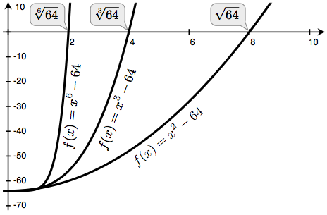

.. _higher-orderFunctions:

===================
Функције вишег реда
===================

Функције су начин апстракције који описује сложене операције независно од појединих вредности аргумената. Наиме, у функцији ``квадрат``,

    >>> def квадрат(x):
    ...     return x * x

није реч о квадрату одређеног броја, већ о начину за добијање квадрата ма ког броја. Наравно, могуће је "преживети" и без дефинисања ове функције, стално пишући изразе као што су, примера ради,

    >>> 3 * 3
    9
    >>> 5 * 5
    25

и никада не помињући ``квадрат`` експлицитно. Ова пракса је довољна за једноставна израчунавања као што је ``квадрат``, али постаје напорна за сложеније примере као што су ``abs`` и ``фиб``. Уопштено говорећи, потенцијалан недостатак функција би приморао програмере да увек раде на нивоу специфичних операција које су примитиве у датом програмском језику (множење, у конкретном случају), уместо са операцијама високог нивоа. Програми би били способни да израчунају квадрат, али би језику недостајала могућност да изрази концепт квадрирања.

Једна од ствари које се захтевају од моћног програмског језика јесте способност изградње апстракција кроз доделу имена уобичајеним обрасцима и потоње непосредно коришћење тих имена. Функције обезбеђују ову могућност. Као што ће се видети у наредним примерима, постоје уобичајени програмски обрасци који се понављају у изворном коду и користе се са низом различитих функција. Ови обрасци такође могу бити апстраховани кроз давање имена.

Како би се одређени општи обрасци изразили кроз именоване концепте, биће потребно изградити функције које примају друге функције као аргументе или враћају функције као вредности. Функције које баратају функцијама се зову функције вишег реда. Овај одељак показује како функције вишег реда могу служити као моћан механизам апстракције који многоструко повећава изражајну моћ језика.

.. _functionsAsArguments:

Функције као аргументи
----------------------

Размотримо следеће три функције које све израчунавају збирове. Прва, ``збирБројева``, израчунава збир природних бројева до ``n``:

    >>> def збирБројева(n):
    ...     збир, k = 0, 1
    ...     while k <= n:
    ...         збир, k = збир + k, k + 1
    ...     return збир

    >>> збирБројева(100)
    5050

Друга, ``збирКубова``, рачуна збир кубова природних бројева до ``n``:

    >>> def збирКубова(n):
    ...     збир, k = 0, 1
    ...     while k <= n:
    ...         збир, k = збир + k*k*k, k + 1
    ...     return збир

    >>> збирКубова(100)
    25502500

Трећа, ``пиЗбир``, рачуна збир првих ``n`` чланова реда

.. math::

    \displaystyle\sum_{k=1}^{\infty}\frac{8}{(4k-3)(4k-1)} = \frac{8}{1\cdot3} + \frac{8}{5\cdot7} + \frac{8}{9\cdot11} + \cdots

који конвергира ка броју :math:`\pi` веома споро.

    >>> def пиЗбир(n):
    ...     збир, k = 0, 1
    ...     while k <= n:
    ...         збир, k = збир + 8 / ((4*k-3) * (4*k-1)), k + 1
    ...     return збир

    >>> пиЗбир(100)
    3.1365926848388144

Ове три функције очигледно деле заједнички основни образац. Оне су у већем делу истоветне, а разликују се само по имену и функцији променљиве ``k`` која се користи за израчунавање члана који се сабира. Све три функције могу бити произведене попуњавањем два поља у следећем обрасцу::

    def <име>(n):
        збир, k = 0, 1
        while k <= n:
            збир, k = збир + <члан>(k), k + 1
        return збир

Присуство једног таквог заједничког обрасца јесте снажан доказ постојања корисне апстракције која чека да буде искоришћена. Свака од ових функција представља збир чланова. Пројектант програма жели да програмски језик буде довољно моћан да се у њему може написати функција која изражава концепт збира као таквог, а не само функције које рачунају збир. Наравно Пајтон је спреман за овакве ствари и директно из горе приказаног заједничког обрасца могуће је направити апстракцију увођењем формалних параметара на месту празних поља.

У примеру који следи, функција ``сабирање`` прима два аргумента и то: горњу границу ``n`` као и функцију која израчунава ``k``-ти члан. Иако језгровито изражава збир, могуће је користити ``сабирање`` као и било коју другу функцију. Користећи се функцијом ``истоветност`` која враћа свој аргумент једноставно се осликава збир првих ``n`` природних бројева:

    >>> def сабирање(n, члан):
    ...     збир, k = 0, 1
    ...     while k <= n:
    ...         збир, k = збир + члан(k), k + 1
    ...     return збир

    >>> def истоветност(x):
    ...     return x

    >>> def збирБројева(n):
    ...     return сабирање(n, истоветност)

    >>> збирБројева(10)
    55

Функција сабирање може бити позвана и директно, без дефинисања друге функције за посебну секвенцу.

    >>> сабирање(10, квадрат)
    385

Са друге стране, једноставним дефинисањем функције ``куб`` која враћа куб свог аргумента, може се извршити сабирање кубова користећи се истом функцијом ``сабирање`` као и раније:

    >>> def куб(x):
    ...     return x * x * x

    >>> def збирКубова(n):
    ...     return сабирање(n, куб)

    >>> збирКубова(3)
    36

Може се дефинисати и ``пиЗбир`` користећи се апстракцијом ``сабирање`` тако што се једноставно дефинише функција ``пиЧлан`` за израчунавање сваког члана. Задајући аргумент ``1e6``, што је скраћени запис за ``1 * 10^6 = 1000000``, добија се добра апроксимација броја :math:`\pi`:

    >>> def пиЧлан(x):
    ...     return 8 / ((4*x-3) * (4*x-1))

    >>> def пиЗбир(n):
    ...     return сабирање(n, пиЧлан)

    >>> пиЗбир(1e6)
    3.141592153589902

.. _functionsAsGeneralMethods:

Функције као опште методе
-------------------------

Кориснички дефинисане функције као механизам за апстракцију образаца нумеричких операција су уведене као независне од специфичних бројева који су укључени у израчунавања. Кроз функције вишег реда, још моћнија врста апстракција је виђена: неке функције изражавају опште методе израчунавања, независне од специфичних функција које том приликом позивају.

Упркос овом појмовном проширењу о томе шта функција представља, модел окружења који описује како се вреднују позивни изрази лако се уопштава без икаквих промена и за случај функција вишег реда. Када се кориснички дефинисана функција примени на неке аргументе, формални параметри се везују за вредности тих аргумената (које могу бити и функције) у новом локалном оквиру.

Размотрити следећи пример који представља општу методу за итеративно побољшање тачности и њено коришћење за израчунавање `златног пресека <http://sr.wikipedia.org/wiki/Златни_пресек>`_. Златни пресек, често означаван са :math:`\varphi`, је ирационалан број близак :math:`1.6` који се често среће у природи, уметности и архитектури.

Алгоритам итеративног побољшања започиње произвољним нагађањем решења једначине. Затим се унутар алгоритма у више наврата примењује функција ``ажурирај`` и проверава блискост да би се, респективно, побољшао резултат и утврдило да ли је ``нагађање`` "довољно близу" како би се сматрало тачним.

    >>> def побољшај(ажурирај, довољноБлиско, нагађање=1):
    ...     while not довољноБлиско(нагађање):
    ...        нагађање = ажурирај(нагађање)
    ...     return нагађање

Функција ``побољшај`` представља општи израз усавршавања кроз понављање. Не специфицира се који проблем се решава већ се појединости остављају функцијама ``ажурирај`` и ``довољноБлиско`` које се прослеђују као аргументи.

Поред осталих добро познатих особина златног пресека ту су и да се златни пресек може израчунати тако што се у више наврата сабере реципрочна вредност ма ког природног броја са један као и та да је златни пресек за један мањи од свог квадрата. Ова својства се могу изразити кроз функције које ће бити коришћене уз ``побољшај`` функцију.

    >>> def златноАжурирање(нагађање):
    ...     return 1/нагађање + 1

    >>> def квадратБлизакСледећем(нагађање):
    ...     return приближноЈеднако(нагађање * нагађање, нагађање + 1)

Изнад је уведен позив ``приближноЈеднако`` који би требало да врати ``True`` ако су прослеђени аргументи приближно једнаки један другоме. Како би се имплементирала функција ``приближноЈеднако``, може се једноставно упоредити апсолутна вредност разлике аргумената са неком малом вредношћу толеранције.

    >>> def приближноЈеднако(x, y, толеранција=1e-15):
    ...     return abs(x - y) < толеранција

Позив ``побољшај`` са аргументима ``златноАжурирање`` и ``квадратБлизакСледећем`` ће израчунати коначну апроксимацију златног пресека.

    >>> побољшај(златноАжурирање, квадратБлизакСледећем)
    1.6180339887498951

.. By tracing through the steps of evaluation, we can see how this result is computed. First, a local frame for improve is constructed with bindings for update, close, and guess. In the body of improve, the name close is bound to square_close_to_successor, which is called on the initial value of guess. Trace through the rest of the steps to see the computational process that evolves to compute the golden ratio.

Овај пример илуструје две међусобно повезане велике идеје у рачунарству. Прва, именовање и функције допуштају да се изапстракује огроман део сложености. Иако је свака дефиниција функције тривијална, ток израчунавања установљен поступком вредновања је прилично замршен. Друга, само кроз својство чињенице да је било могуће написати изузетно опште поступке вредновања у Пајтону овако мали делови могу бити састављени у сложен процес. Разумевање поступка тумачења програма омогућава потврду и преглед процеса израчунавања који је управо направљен.

Као и увек, општој методи ``побољшај`` потребан је одговарајући тест да провери њену исправност. Како постоји, а и позната је и тачна вредност златног пресека у затвореном облику, могуће је упоредити је са итеративном апроксимацијом златног пресека како би се направио један такав тест за златни пресек.

    >>> златниПресек = (1 + 5**0.5)/2
    >>> def тестПобољшај():
    ...    апроксимацијаЗлатногПресека = побољшај(златноАжурирање, квадратБлизакСледећем)
    ...    assert приближноЈеднако(златниПресек, апроксимацијаЗлатногПресека), 'апроксимација није добра'

    >>> тестПобољшај()

За овај конкретан тест, добра порука је ако нема поруке: ``тестПобољшај`` враћа ``None`` након што је наредба провере ``assert`` успешно извршена.

Дефинисање функција III: угнежђене дефиниције
---------------------------------------------

Претходни пример показује да способност прослеђивања функција као аргумената значајно унапређује изражајну снагу програмског језика. Сваки општи концепт или једначина се преводи у себи својствену кратку функцију. Једна негативна последица овог приступа јесте да глобални оквир постаје претрпан именима кратких функција која сва морају бити јединствена. Други проблем јесте ограничење које уносе специфични потписи функција: наиме аргумент ``ажурирај`` унутар финкције ``побољшај`` мора примити тачно један аргумент. Угнежђене дефиниције функција одстрањују оба ова недостатка, али захтевају да се досадашњи модел окружења обогати.

Размотримо нови проблем: израчунавање квадратног корена броја. У програмским језицима, квадратни корен се често скраћено записује као ``sqrt`` од енглеског *square root*. Понављање позива следећег ажурирања конвергира ка квадратном корену броја ``a``:

    >>> def просек(x, y):
    ...     return (x + y)/2

    >>> def кореноАжурирање(x, a):
    ...     return просек(x, a/x)

Ова функција ажурирања која прима два аргумента је неспојива са ``побољшај`` функцијом (јер узима два аргумента, а не један), а и направљена је тако да врши само једно ажурирање вредности иако је више поновних ажурирања неопходно да би се извадио квадратни корен. Решење за оба ова питања јесте смештање дефиниције функција унутар тела друге функције.

    >>> def корен(a):
    ...     def кореноАжурирање(x):
    ...         return просек(x, a/x)
    ...     def коренБлизак(x):
    ...         return приближноЈеднако(x * x, a)
    ...     return побољшај(кореноАжурирање, коренБлизак)

Као и локалне доделе, локалне ``def`` наредбе искључиво утичу на тренутни локални оквир. Ове функције су само видљиве док се ``корен`` вреднује. Доследно поступку вредновања, локалне ``def`` наредбе се уопште не извршавају све док ``корен`` није позван.

.. _lexicalScope:

Лексичка област видљивости
^^^^^^^^^^^^^^^^^^^^^^^^^^

Локално дефинисане функције такође имају приступ везивним називима у области видљивости у којој су дефинисане. У овом примеру, ``кореноАжурирање`` обраћа се називу ``a``, који је формални параметар ``корен`` функције која је обухвата. Ова пракса дељења назива међу угнежђеним дефиницијама се зове лексичка област видљивости. Кључно је да унутрашње функције имају приступ именима из окружења где су дефинисане (не где су позване).

Захтевају се два проширења модела окружења да се омогући лексичка област видљивости.

#. Свака кориснички дефинисана функција има родитељско окружење, односно окружење у коме је дефинисана.
#. Приликом позива кориснички дефинисане функције њен локални оквир проширује њено родитељско окружење.

До функције ``корен``, све функције су дефинисане у глобалном окружењу тако да су све имале истог родитеља, то јест глобално окружење. Насупрот томе, када Пајтон вреднује прве две клаузуле унутар тела функције ``корен``, ствара функције које су придружене локалном окружењу. У позиву

    >>> корен(256)
    16.0

окружење најпре додаје локални оквир за ``корен``, а затим вреднује ``def`` наредбе за ``кореноАжурирање`` и ``коренБлизак``.

Као што је речено, свака вредност функције има *родитеља*. Родитељ вредности функције јесте први оквир окружења у коме је та функција дефинисана. Приликом позива кориснички дефинисаних функција, створени оквир носи исто име као и сама функција.

Накнадно, назив ``кореноАжурирање`` разлучује ову новодефинисану функцију, која је прослеђена као аргумент ``побољшај`` функцији. Унутар тела ``побољшај``, мора бити примењена функција ``ажурирај`` (повезана на ``кореноАжурирање``) на почетно нагађање ``x`` које је 1. Овај позив ствара окружење за ``кореноАжурирање`` започето локалним оквиром који садржи само ``x``, али са родитељским ``корен`` оквиром који садржи везу на ``a``.

Најкритичнији део овог поступка вредновања јесте пренос родитеља функције ``кореноАжурирање`` на оквир направљен позивом ``кореноАжурирање``.

.. _extendedEnvironments:

Проширена окружења
^^^^^^^^^^^^^^^^^^

Окружење се може састојати из произвољно дугог ланца оквира који се увек завршава глобалним оквиром. До последњег примера са функцијом ``корен``, окружења су се састојала из највише два оквира: локалног оквира и глобалног оквира. Позивом функција које су дефинисане унутар других функција кроз угнежђене ``def`` наредбе могу се направити дужи ланци. Окружење за позив ``кореноАжурирање`` се састоји из три оквира: локални ``кореноАжурирање`` оквир, затим оквир ``корен`` у којем је ``кореноАжурирање`` дефинисано, као и глобални оквир.

Повратни израз ``return`` унутар тела функције ``кореноАжурирање`` може разазнати ``a`` вредност пратећи овај ланац оквира. Тражећи назив проналази се прва вредност повезана са тим именом унутар тренутног окружења. Пајтон најпре проверава оквир ``кореноАжурирање`` и не проналази ``a`` у њему. Пајтон затим проверава родитељски оквир ``корен`` и тамо проналази везу од ``a`` на 256.

Стога, могу се сагледати две предности лексичке области видљивости у Пајтону.

* Имена локалних функција се не мешају са спољашњим именима у односу на функцију у којој су дефинисане зато што се назив локалне функције повезује унутар тренутног локалног окружења у коме је и дефинисан, уместо у глобалном окружењу.
* Локална функција може приступити окружењу обухватајуће функције зато што се тело локалне функције вреднује у окружењу које проширује окружење вредновања у коме је она дефинисана.

Функција ``кореноАжурирање`` носи са собом неке податке: вредност ``a`` из окружења у коме је дефинисана. Зато што на овај начин "затварају" информацију, локално дефинисане функције се често зову *затворења*.

.. _functionsAsReturnedValues:

Функције као повратне вредности
-------------------------------

Могуће је постићи још више изражајне снаге у програмима пишући функције чије повратне вредности су такође функције. Важна одлика програмских језика који подржавају лексичку област видљивости јесте да локално дефинисане функције одржавају родитељско окружење када су враћене. Следећи пример илуструје корисност овог својства.

У неком тренутку када је дефинисан већи број једноставних функција, `композиција функција  <http://sr.wikipedia.org/wiki/Композиција_функција>`_ је природна метода комбиновања коју треба укључити у програмски језик. Односно, ако су дате две функције ``f(x)`` и ``g(x)``, може се дефинисати ``h(x) = f(g(x))``. Композицију функција је могуће дефинисати коришћењем постојећих алата:

    >>> def композиција1(f, g):
    ...     def h(x):
    ...         return f(g(x))
    ...     return h

Веома илустративан може бити пример који укључује и једноставну функцију:

    >>> def следбеник(x):
    ...     return x + 1

и који даље слаже следеће две функције на два начина:

    >>> квадратСледбеника = композиција1(квадрат, следбеник)
    >>> следбеникКвадрата = композиција1(следбеник, квадрат)
    >>> квадратСледбеника(12)
    169
    >>> следбеникКвадрата(12)
    145

Број 1 у ``композиција1`` служи да нагласи да тако добијена сложена функција прима један аргумент. Ова конвенција није обавезујућа, а број 1 јесте само део имена функције.

У овом тренутку почињу да се опажају предности које прецизно дефинисан модел окружења за израчунавања доноси. Наиме, претходни модел окружења у потпуности објашњава могућност враћања функција.

.. _exampleNewtonsMethod:

Пример: Њутнова метода
----------------------

Овај проширен пример приказује како функције као повратне вредности и локалне дефиниције могу бити комбиноване да сажето изразе опште идеје. Биће имплементиран алгоритам који има широку примену у нумеричком израчунавању и оптимизацији.

Њутнова метода је класичан итеративни приступ за израчунавање *корена* математичких функција, односно вредности аргумента за који је вредност функције једнака нули. Налажење *нула* неке функције често је еквивалентно решавању неког другог проблема од интереса, као што је израчунавање квадратног корена.

Као мотивација за оно што следи може послужити и чињеница да се често здраво за готово узима да је једноставно израчунати квадратни корен. Не само Пајтон, већ и телефон, интернет прегледач, или калкулатор, могу то одрадити за вас. Међутим, део учења рачунарства јесте и разумевање како се овакве величине и функције могу израчунати. Општи приступ приказан надаље је применљив на решавање значајне класе једначина и далеко излази ван оквира онога што је уграђено у Пајтон.

Њутнова метода преставља алгоритам итеративног побољшања, односно побољшава нагађање корена ма које *диференцијабилне* функције што, слободно речено, значи да се у свакој тачки може апроксимирати правом. Њутнова метода прати ове линеарне апроксимације да пронађе нуле функције.

Замислимо праву кроз тачку :math:`(x, f(x))` која има исти нагиб као и крива функције :math:`f(x)` у тој тачки. Таква права се назива *тангента*, а њен нагиб је заправо *извод* функције :math:`f` у тачки :math:`x`.

Нагиб праве је однос промене вредности функције према промени аргумента функције. Стога, замењујући :math:`x` са вредношћу функције :math:`f(x)` подељеном са нагибом даће вредност аргумента за који ова тангента додирује нулу.

.. image:: newton.png
    :align: center

За функцију ``f`` и њен извод ``df``, ``њутновоАжурирање`` изражава рачунски поступак праћења тангенте све до нуле.

    >>> def њутновоАжурирање(f, df):
    ...     def ажурирај(x):
    ...         return x - f(x) / df(x)
    ...     return ажурирај

Коначно, може се дефинисати функција ``пронађиНулу`` користећи ``њутновоАжурирање``, ``побољшај`` алгоритам и поређење да се провери да ли је :math:`f(x)` близу 0.

    >>> def пронађиНулу(f, df):
    ...     def близуНуле(x):
    ...         return приближноЈеднако(f(x), 0)
    ...     return побољшај(њутновоАжурирање(f, df), близуНуле)

.. _computingRoots:

Израчунавање корена
^^^^^^^^^^^^^^^^^^^

Користећи Њутнову методу, могуће је израчунати корен произвољног степена :math:`n`. Корен :math:`n`-тог степена неког броја :math:`a`, односно :math:`n`-ти корен од :math:`a`, јесте :math:`x` такво да је :math:`x \cdot x \cdot x \cdot\ldots\cdot x = x^n = a`. На пример,

* квадратни (други) корен од 64 је 8, зато што је :math:`8 \cdot 8 = 64`.

* кубни (трећи) корен од 64 је 4, зато што је :math:`4 \cdot 4 \cdot 4 = 64`.

* шести корен од 64 је 2, зато што је :math:`2 \cdot 2 \cdot 2 \cdot 2 \cdot 2 \cdot 2 = 64`.

Користећи следећа запажања, могуће је израчунати корен помоћу Њутнове методе:

* квадратни корен од 64 (записано :math:`\sqrt{64}`) је вредност :math:`x` таква да је :math:`x^2 - 64 = 0`.

* уопштено, :math:`n`-ти корен од :math:`a` (записано :math:`\sqrt[n]{a}`) је вредност :math:`x` таква да је :math:`x^n - a = 0`.

Кад се знају решења последње једначине, тада се зна израчунати и корен :math:`n`-тог степена. Исцртавајући криве за :math:`n` које узима вредности 2, 3 и 6, и :math:`a` једнако 64, могуће је визуализовати ову зависност.

Најпре ће бити имплементиран ``квадратниКорен`` дефинишући функцију ``f`` и њен извод ``df``. Из математичке анализе познато је да је први извод :math:`f(x) = x^2 - a` линеарна функција :math:`f^\prime(x) = 2x`.

    >>> def квадратниКорен(a):
    ...     def f(x):
    ...         return x * x - a
    ...     def df(x):
    ...         return 2 * x
    ...     return пронађиНулу(f, df)

    >>> квадратниКорен(64)
    8.0

Ради уопштења за тражење корена произвољног степена :math:`n`, потребна је функција :math:`f(x) = x^n - a` и њен извод :math:`f^\prime(x) = n \cdot x^{n-1}`.

    >>> def степен(x, n):
    ...     """Враћа x * x * x * ... * x где се x понавља n пута."""
    ...     производ, k = 1, 0
    ...     while k < n:
    ...         производ, k = производ * x, k + 1
    ...     return производ

    >>> def nтиКорен(n, a):
    ...     def f(x):
    ...         return степен(x, n) - a
    ...     def df(x):
    ...         return n * степен(x, n-1)
    ...     return пронађиНулу(f, df)

    >>> nтиКорен(2, 64)
    8.0
    >>> nтиКорен(3, 64)
    4.0
    >>> nтиКорен(6, 64)
    2.0

Грешка апроксимације у свим овим израчунавањима може се умањити променом параметра ``толеранција`` у функцији ``приближноЈеднако`` на још нижу вредност.

Приликом експериментисања и играња са Њутновом методом треба бити обазрив да она не конвергира увек. Почетно нагађање за ``побољшај`` мора бити довољно близу нуле и потребно је да функција задовољава неколико услова. Упркос овим недостацима, Њутнова метода представља моћну општу рачунску методу за тражење нула диференцијабилних функција. Јако брзи нумерички алгоритми за израчунавање логаритама и дељења великих целобројних вредности користе варијанте ове технике у савременим рачунарима.

.. _currying:

Каринг
------

Функције вишег реда могу се користити да претворе функцију која прима више аргумената у ланац функција од којих свака прима један аргумент. Конкретно, ако је дата функција ``f(x, y)``, могуће је дефинисати функцију ``g`` такву да је ``g(x)(y)`` еквивалентно ``f(x, y)``. Овде ``g`` представља функцију вишег реда која прима један аргумент ``x`` и враћа другу функцију која прима један аргумент ``y``. Ова трансформација назива се *каринг*.

Као пример, могуће је дефинисати каринговану варијанту ``pow`` функције:

    >>> def карингованСтепен(x):
    ...     def h(y):
    ...         return pow(x, y)
    ...     return h

    >>> карингованСтепен(2)(3)
    8

Неки програмски језици, као што је Хаскел, само дозвољавају дефинисање функција које примају један аргумент тако да програмер мора користити ову технику за све процедуре са више аргумената. У општијим програмским језицима као што је Пајтон, каринг може бити користан када се захтева функција која прима само један аргумент. На пример, ``map`` образац примењује функцију једног аргумента на низ вредности. У каснијим поглављима биће приказани општији примери ``map`` обрасца, али за сада, могуће је имплементирати овај образац у функцији:

    >>> def mapНаОпсег(почетак, крај, f):
    ...     while почетак < крај:
    ...         print(f(почетак))
    ...         почетак = почетак + 1

Уместо писања засебне функције која би то урадила, могу се искористити ``mapНаОпсег`` и ``карингованСтепен`` како би се срачунали и исписали првих десет степена двојке:

    >>> mapНаОпсег(0, 10, карингованСтепен(2))
    1
    2
    4
    8
    16
    32
    64
    128
    256
    512

Слично томе, могу се искористити исте функције да би се израчунали степени неких других бројева. Каринг дозвољава да се то учини без писања посебних функција за сваки појединачан број чији степени се желе израчунати.

У горњим примерима, ручно је извршено каринг претварање ``pow`` функције да би се добила ``карингованСтепен`` функција. Уместо тога, могуће је дефинисати функције да се аутоматизује каринг и њему инверзно претварање:

    >>> def каринг2(f):
    ...     """Враћа каринговану варијанту задате функције два аргумента."""
    ...     def g(x):
    ...         def h(y):
    ...             return f(x, y)
    ...         return h
    ...     return g

    >>> def карингИнв2(g):
    ...     """Враћа двоаргументну варијанту задате каринговане функције."""
    ...     def f(x, y):
    ...         return g(x)(y)
    ...     return f

    >>> степенКарингован = каринг2(pow)
    >>> степенКарингован(2)(5)
    32
    >>> mapНаОпсег(0, 10, степенКарингован(2))
    1
    2
    4
    8
    16
    32
    64
    128
    256
    512

Функција ``каринг2`` прима двоаргументну функцију ``f`` и враћа једноаргументну функцију ``g``. Када се ``g`` примени на аргумент ``x``, враћа једноаргументну функцију ``h``. Када се ``h`` примени на ``y`` позива се ``f(x, y)``. Зато је позив ``каринг2(f)(x)(y)`` еквивалентан позиву ``f(x, y)``. Функција ``карингИнв2`` преокреће каринг претварање, тако да је позив ``карингИнв2(каринг2(f))`` еквивалентан позиву ``f``.

    >>> карингИнв2(степенКарингован)(2, 5)
    32

.. _lambdaExpressions:

Ламбда изрази
-------------

До сада, сваки пут када је дефинисана нова функција, било је неопходно дати јој име. За друге врсте израза, није било потребе да се међурезултати израчунавања именују. Односно, могуће је израчунати ``a*b + c*d`` без обавезе именовања подизраза ``a*b`` или ``c*d``, или пак целог израза. У Пајтону, могуће је направити функције у лету користећи ``lambda`` изразе који се вреднују у неименоване функције. Ламбда израз се вреднује у функцију која у свом телу враћа један израз. Наредбе доделе и управљања, као што су петље, нису дозвољене.

    >>> def композиција1(f, g):
    ...     return lambda x: f(g(x))

Структура ``lambda`` израза може се разумети изградњом одговарајуће реченице у српском језику::

   -      lambda            x           :        f(g(x))
   -   Функција која     прима x     и враћа     f(g(x))

Резултат ламбда израза се назива ламбда функцијом. Она нема својствено име (због чега Пајтон штампа ``<lambda>`` као име), али се иначе понаша баш као и свака друга функција.

    >>> s = lambda x: x * x
    >>> print(s.__name__)
    <lambda>
    >>> s(12)
    144

У дијаграму окружења, резултат ламбда израза је такође функција именована грчким словом :math:`\lambda` (ламбда). Пример комозиције може се изразити прилично компактно преко ламбда израза.

    >>> def композиција1(f, g):
    ...     return lambda x: f(g(x))
    >>> f = композиција1(lambda x: x * x, lambda y: y + 1)
    >>> f(12)
    169

Неки програмери су мишљења да је коришћење неименованих функција из ламбда израза краће и директније. Међутим, сложени ``lambda`` изрази су ноторно нечитљиви, упркос њиховој сажетости. Следећа дефиниција је исправна, али многи програмери имају проблем са брзим разумевањем исте.

    >>> композиција1 = lambda f,g: lambda x: f(g(x))

Углавном, `смернице за Пајтонов стил <http://www.python.org/dev/peps/pep-0008>`_ су наклоњеније експлицитним ``def`` наредбама него ламбда изразима, али их допуштају у случајевима када су једноставне функције неопходне као аргумент или повратна вредност.

Ова стилска правила представљају само смернице, а наравно да је могуће програмирати на који год се начин жели. Ипак, током писања програма, треба мислити и на људе који ће можда читати тај програм једнога дана. Уколико се може поједноставити разумевање програма, тада се тим људима заправо чини услуга.

Назив *ламбда* је више сплет несрећних околности и производ некомпатибилности писаног математичког означавања са ограничењима раних штампарија.

     Делује изопачено користити ламбда за представљање процедуре/функције. Међутим, ово обележавање потиче још од `Алонза Черча <http://sr.wikipedia.org/wiki/Алонзо_Черч>`_ који је тридесетих година прошлог века увео симбол "капице"; писао је квадратну функцију као :math:`\hat{y}.y \times y`. Међутим, фрустрирани словослагачи (типографи) су померили капицу с леве стране параметра и променили је у велико грчко слово ламбда: :math:`\Lambda y.y \times y`; те је онда велико слово ламбда промењено у мало и данас се користи нотација :math:`\lambda y.y \times y` у математичким књигама и ``(lambda (у) (* у у))`` у програмском језику Лисп.

     ---Питер Норвиг (http://www.norvig.com/lispy2.html)

Упркос својој необичној етимологији, ламбда изрази и одговарајући формалан језик за апликацију функција, ламбда рачун, су основни концепти у рачунарству и сежу далеко изнад Пајтонове програмерске заједнице. Ова тема поново ће бити актуелна у трећем поглављу током проучавања пројектовања интерпретатора.

.. _abstractionsAndFirst-ClassFunctions:

Апстракције и првокласне функције
---------------------------------

Овај одељак је започет запажањем да су кориснички дефинисане функције кључни механизам апрстракције зато што дозвољавају изражавање општих метода израчунавања као експлицитних елемената у програмском језику. Касније је приказано како функције вишег реда дозвољавају руковање овим општим методама да би се створиле више апстракције.

Програмери би требали да буду спремни да уоче сваку прилику за потенцијалну апстракцију у својим програмима, а затим да је искористе и уопште их тако што ће створити још моћније апстракције. Ово не значи да увек треба писати програме на најапстрактинији могући начин. Искусни програмери знају да изаберу ниво апстракције који је примерен за одређени задатак. Ипак, важно је имати могућност размишљања у правцу и смислу ових апстракција како би били спремни за њихову примену у новом контексту или сценарију. Значај функција вишег реда је да оне омогућавају представљање апстракција експлицитно као елементе програмских језика па се њима може баратати баш као и са осталим рачунским елементима.

Уопштено, програмски језици намећу ограничења у начину на који се рачунским елементима може руковати. За елементе са најмањим ограничењима се каже да имају првокласни положај. Нека од "права и повластица" првокласних елемената су:

#. Могу им се додељивати називи.
#. Могу се прослеђивати као аргументи функција.
#. Могу се враћати као резултати функција.
#. Могу бити укључени у структуре података.

Пајтон додељује функцијама пун првокласни положај и резултујући добитак у изражајној моћи је огроман.

.. _functionDecorators:

Декоратери функција
-------------------

Пајтон обезбеђује посебну синтаксу, која се назива декоратер, за примену функција вишег реда као део извршавајућих ``def`` наредби. Можда најчешћи пример јесте такозвани траг.

    >>> def траг1(функција):
    ...     def омотач(x):
    ...         print('-> ', функција.__name__, '(', x, ')')
    ...         return функција(x)
    ...     return омотач

    >>> @траг1
    ... def троструко(x):
    ...     return 3 * x

    >>> троструко(12)
    ->  троструко ( 12 )
    36

У претходном примеру, дефинисана је функција вишег реда ``траг1`` која као аргумент прима функцију једног аргумента, а враћа исту функцију допуњену претходним позивом наредбе ``print`` са исписом имена функције и њеним аргументом. Наредба ``def`` за ``троструко`` има прибелешку ``@траг1`` која утиче на извршење ``def`` наредбе. Као и обично, функција ``троструко`` је направљена. Међутим, назив ``троструко`` није везан за ову функцију. Уместо тога, назив ``троструко`` је везан на повратну вредност функције ``траг1`` позвану са новонаправљеном функцијом ``троструко`` као својим аргументом. У коду, овај декоратер је еквивалентан:

    >>> def троструко(x):
    ...     return 3 * x

    >>> троструко = траг1(троструко)

У пројектима везаним за овај рукопис, декоратери се користе за праћење као и за избор функције која ће бити позвана приликом покретања програма из командне линије.

.. _extraForExperts:

Додатак за стручњаке
^^^^^^^^^^^^^^^^^^^^

Симбол декоратера ``@`` може такође бити праћен изразом позива. Израз који следи након ``@`` се вреднује први (баш као што се назив ``траг1`` најпре вредновао горе), затим ``def`` наредба друга, и најзад повратна вредност вредновања декоратер израза бива примењена на новодефинисану функцију чији резултат је повезан са називом у ``def`` наредби.
