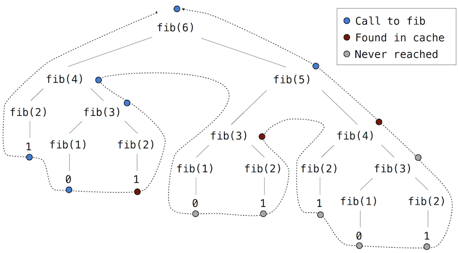

.. _efficiency:

==========
Ефикасност
==========

На одлуке о начину представљања и обраде података често утиче ефикасност доступних могућности. Ефикасност се односи на рачунске ресурсе које користи представа или процес то јест поступак, као што је колико времена и меморије је неопходно за израчунавање резултата функције или представљања објекта. Ови ресурси могу у значајној мери да варирају у зависности од имплементационих појединости.

.. _measuringEfficiency:

Мерење ефикасности
------------------

Мерење тачно колико дуго времена треба програму да се извршава или колико меморије троши је изазовно, јер резултати зависе од многих појединости о томе како је рачунар конфигурисан. Поузданији начин за карактеризацију ефикасности програма јесте мерење колико пута се неки догађај догоди, као што је на пример позив неке функције.

За илустрацију, вратимо се првом примеру резурзивног стабла, односно ``фиб`` функцији за израчунавање бројева Фибоначијевог низа.

    >>> def фиб(n):
    ...     if n == 0:
    ...         return 0
    ...     if n == 1:
    ...         return 1
    ...     return фиб(n-2) + фиб(n-1)

    >>> фиб(5)
    5

Размотримо образац израчунавања који је резултат вредновања ``фиб(6)``, приказан доле. Да би се израчунао ``фиб(5)``, морају се срачунати ``фиб(3)`` и ``фиб(4)``. Да би се израчунао ``фиб(3)``, рачунају се ``фиб(1)`` и ``фиб(2)``. Генерално гледано, овај еволутивни процес изгледа попут стабла. Свака плава тачка означава завршено израчунавање Фибоначијевог броја у преласку овог стабла.

.. image:: fib.png
    :align: center

Ова функција је поучна као прототипско рекурзивно стабло или стабло рекурзије, али је ужасно неефикасан начин израчунавања бројева Фибоначијевог низа јер врши толико сувишних израчунавања. Рецимо, целокупно израчунавање ``фиб(3)`` је дуплирано.

Могуће је и измерити ову неефикасност. Функција вишег реда ``изброј`` враћа еквивалентну функцију свом аргументу која такође одржава и атрибут ``бројПозива``. На тај начин може се погледати колико је пута функција ``фиб`` позвана.

    >>> def изброј(f):
    ...     def избројан(*args):
    ...         избројан.бројПозива += 1
    ...         return f(*args)
    ...     избројан.бројПозива = 0
    ...     return избројан

Бројећи број позива функцији ``фиб``, види се да број потребних позива расте брже од самих Фибоначијевих бројева. Ово брза експлозија броја позива карактеристична је за рекурзивна стабла уопште.

    >>> фиб = изброј(фиб)
    >>> фиб(19)
    4181
    >>> фиб.бројПозива
    13529

.. _space:

Простор
^^^^^^^

Да би се разумеле просторне потребе функције, мора се генерално навести како се меморија користи, чува и враћа у успостављеном моделу окружења и израчунавања. При вредновању израза, интерпретатор чува сва *активна* окружења и све вредности и оквире на које се та окружења позивају. Окружење је активно ако пружа контекст вредновања за неки израз који се вреднује. Окружење постаје неактивно кад год се позив функције за који је њен први оквир створен коначно заврши.

На пример, приликом вредновања функције ``фиб``, интерпретатор наставља да израчунава сваку вредност у претходно приказаном редоследу, пролазећи кроз структуру стабла. Да би то урадио, потребно је само да прати оне чворове у стаблу који су изнад тренутног чвора и то у свакој тачки израчунавања. Меморија коришћена за вредновање остатка грана стабла може се повратити јер не може утицати на будућа израчунавања. Уопштено гледано, простор потребан за функције рекурзивног стабла биће пропорционалан максималној дубини стабла.

Дијаграм у наставку приказује окружење створено вредновањем ``фиб(3)``. У поступку вредновања повратног израза за почетну примену функције ``фиб``, израчунава се израз ``фиб(n-2)``, дајући вредност 0. Једном када се израчуна ова вредност, одговарајући оквир окружења више није потребан и није више део активног окружења. Дакле, добро пројектовани интерпретатор може ослободити и повратити меморију која је коришћена за чување овог оквира. С друге стране, ако интерпретатор тренутно процењује ``фиб(n-1)``, тада је активно окружење створено овом апликацијом ``фиб`` (у коме је ``n`` једнако 2). По редоследу, окружење првобитно створено за примену ``фиб`` на 3 је активно јер његова повратна вредност још увек није израчуната.

Функција вишег реда ``избројОквире`` прати ``бројОтворених`` што представља број позива функцији ``f`` који се још нису завршили. Атрибут ``максБрој`` је максимална вредност коју је ``бројОтворених`` достигао и одговара максималном броју оквира који су били истовремено активни током читавог тока израчунавања.

    >>> def избројОквире(f):
    ...     def избројан(*args):
    ...         избројан.бројОтворених += 1
    ...         избројан.максБрој = max(избројан.максБрој, избројан.бројОтворених)
    ...         резултат = f(*args)
    ...         избројан.бројОтворених -= 1
    ...         return резултат
    ...     избројан.бројОтворених = 0
    ...     избројан.максБрој = 0
    ...     return избројан

    >>> фиб = избројОквире(фиб)
    >>> фиб(19)
    4181
    >>> фиб.бројОтворених
    0
    >>> фиб.максБрој
    19
    >>> фиб(24)
    46368
    >>> фиб.максБрој
    24

Као резиме, потребан простор за ``фиб`` функцију, мерен у броју активних оквира, за један је мањи од улаза, који има тенденцију да буде релативно мали. Временски захтеви мерени у укупном броју рекурзивних позива је већи од излаза, који има тенденцију да буде огроман.

.. _memoization:

Мемоизација
-----------

Стабла рекурзије као рачунски процеси често се могу учинити ефикаснијим користећи *мемоизацију*, моћну технику за повећање ефикасности рекурзивних функција које понављају израчунавања. Мемоизирана функција похраниће повратну вриједност за све аргументе које је претходно примила. Други позив ``фиб(25)`` неће поново израчунавати повратну вредност рекурзивно, већ ће вратити постојећу која је већ израчуната раније.

Мемоизација се може природно изразити као функција вишег реда, која се такође може користити као декоратер. Дефиниција у наставку ствара кеш претходно израчунатих резултата, индексираних аргументима из којих су израчунати. Коришћење речника захтева да аргумент мемоизиране функције буде непроменљив.

    >>> def мемо(f):
    ...     кеш = {}
    ...     def мемоизирано(n):
    ...         if n not in кеш:
    ...             кеш[n] = f(n)
    ...         return кеш[n]
    ...     return мемоизирано

Ако применимо ``мемо`` на рекурзивно рачунање Фибоначијевих бројева, еволуираће нови образац израчунавања, приказан у наставку.

У овом израчунавању ``фиб(5)``, резултати за ``фиб(2)`` и ``фиб(3)`` се поново користе приликом израчунавања ``фиб(4)`` на десној грани стабла. Као резултат тога, већи део рекурзивног израчунавања у стаблу уопште није потребан.

Користећи ``изброј``, може се видети да се функција ``фиб`` заправо позива само једном за сваки јединствени улаз у ``фиб``.

    >>> бројаниФиб = изброј(фиб)
    >>> фиб  = мемо(бројаниФиб)
    >>> фиб(19)
    4181
    >>> бројаниФиб.бројПозива
    20
    >>> фиб(34)
    5702887
    >>> бројаниФиб.бројПозива
    35

.. _ordersOfGrowth:

Величине раста
--------------

.. Степен раста можда боље него величина раста

Процеси се могу значајно разликовати по брзини којом троше просторне и временске рачунарске ресурсе, као што то илуструју претходни примери. Међутим, тачно одредити колико простора или времена ће се користити приликом позивања функције врло је тежак задатак који зависи од многих фактора. Користан начин анализе процеса је његова категоризација заједно са групом процеса који сви имају сличне захтеве. Корисна категоризација је такозвана *величина раста* процеса, који једноставним изразима изражава како захтеви за ресурсима у процесу расту у зависности од улазних података.

Као увод у величине раста, биће анализирана функција ``избројДелитеље`` у наставку, која рачуна колико има природних бројева који су делитељи улазног броја ``n``, односно који када га поделе дају остатак нула. Функција покушава да подели ``n`` са сваким природним бројем који је мањи или једнак његовом квадратном корену. Имплементација користи предности чињенице да ако :math:`k` дели :math:`n` и :math:`k<\sqrt{n}`, онда постоји још један делитељ :math:`j=n/k` такав да је :math:`j>\sqrt{n}`.

    >>> from math import sqrt
    >>> def избројДелитеље(n):
    ...     sqrt_n = sqrt(n)
    ...     k, бројДелитеља = 1, 0
    ...     while k < sqrt_n:
    ...         if n % k == 0:
    ...             бројДелитеља += 2
    ...         k += 1
    ...     if k * k == n:
    ...         бројДелитеља += 1
    ...     return бројДелитеља
    >>> избројДелитеље(576)
    21

Колико времена је потребно за вредновање функције ``избројДелитеље``? Прецизан одговор ће се разликовати од рачунара до рачунара, али се могу дати нека општа корисна запажања о укупној количини израчунавања која учествују у поступку. Укупан број извршавања тела ``while`` наредбе је највећи природан број мањи од :math:`\sqrt{n}`. Наредбе пре и после ове ``while`` петље извршавају се тачно једном. Дакле, укупан број извршених наредби је :math:`w\cdot\sqrt{n}+v`, где је :math:`w` број израза у телу ``while`` петље, а :math:`v` број израза изван ``while`` наредбе. Иако није егзактна, ова формула углавном добро карактерише колико времена ће бити неопходно за вредновање функције ``избројДелитеље`` у зависности од улазног параметра ``n``.

Тачнији опис је тешко добити. Константе :math:`w` и :math:`v` уопште нису константне, јер се изрази доделе променљивој ``бројДелитеља`` понекад извршавају, а понекад не. Анализа величине раста омогућава да се занемаре такве појединости и уместо тога се фокусира на општи облик раста. Конкретно, величина раста за ``избројДелитеље`` прецизно изражава да се време потребно за израчунавање ``избројДелитеље(n)`` скалира брзином :math:`\sqrt{n}`, унутар маргине неких константних фактора.

.. _thetaNotation:

Тета нотација
^^^^^^^^^^^^^

Нека је :math:`n` параметар који мери величину улаза у неки процес, а нека је :math:`R(n)` количина неког ресурса који тај процес захтева за улаз величине :math:`n`. У претходним примерима за :math:`n` је узет број за који је требало израчунати вредност дате функције, али постоје и друге могућности. На пример, ако је циљ израчунавање апроксимације квадратног корена неког броја, могло би се узети да :math:`n` представља број потребних цифара тачности.

:math:`R(n)` може бити мера количине искоришћене меморије или број изведених основних машинских корака, и слично. На рачунарима који изводе само фиксан број корака у јединици времена, време потребно за вредновање неког израза биће пропорционално броју основних корака изведених у поступку вредновања.

Кажемо да :math:`R(n)` има величину раста :math:`\Theta(f(n))`, записано као :math:`R(n)=\Theta(f(n))` (изговара се "тета од :math:`f(n)`"), ако постоје позитивне константе :math:`k_1` и :math:`k_2` независне од :math:`n` такве да

.. math:: k_1 \cdot f(n) \le R(n) \le k_2 \cdot f(n)

за било коју вредност :math:`n` већу од неког минимума :math:`m`. Другим речима, за велико :math:`n`, вредност :math:`R(n)` је увек смештена између неке две вредности које обе расту са :math:`f(n)`:

* доње границе :math:`k_1 \cdot f(n)` и
* горње границе :math:`k_2 \cdot f(n)`.

Ова дефиниција се може применити да се покаже да број корака потребних за израчунавање функције ``избројДелитеље(n)`` расте као :math:`\Theta(\sqrt{n})` једноставном инспекцијом тела функције.

Прво, узима се :math:`k_1 = 1` и :math:`m = 0`, тако да је доња граница коју ``избројДелитеље(n)`` захтева најмање :math:`1 \cdot \sqrt{n}` корака за било које :math:`n>0`. Постоје најмање четири линије кода које се извршавају изван ``while`` петље, где свакој од њих треба најмање један корак да се изврши. Постоје најмање две линије које се извршвају унутар ``while`` петље, заједно са самим ``while`` заглављем. Све ово захтева бар један корак. Тело ``while`` петље се извршава најмање :math:`\sqrt{n}-1` пута. Састављајући ове доње границе, примећује се да поступак захтева најмање :math:`4+3\cdot(\sqrt{n}-1)` корака, што је увек веће од :math:`k_1 \cdot \sqrt{n}`.

Друго, може се потврдити и горња граница. Претпоставимо да било која појединачна линија кода у телу функције ``избројДелитеље`` захтева највише :math:`p` корака. Ова претпоставка не важи у општем слуају за сваку линију Пајтон кода, али важи у овом случају. Затим, извршавање ``избројДелитеље(n)`` може захтевати највише :math:`p\cdot(5+4\sqrt{n})`, јер постоји пет линија кода изван ``while`` петље и четири унутар (укључујући ту и само заглавље). Ова горња граница важи чак и ако се сваки ``if`` услов процени као логички тачан. Коначно, ако се изабере :math:`k_2 = 5p`, тада је број потребних корака увек мањи од :math:`k_2\cdot\sqrt{n}`. Тиме је доказ завршен.

.. _example:Exponentiation:

Пример: степеновање
-------------------

Размотримо проблем израчунавања степена датог броја. У суштини, жеља је да се напише функцију која као аргументе прима основу :math:`b` и природан број :math:`n` као експонент, односно степен и израчунава :math:`b^n`. Један од начина да се то уради јесте преко рекурзивне дефиниције

.. math::

    b^n&=b \cdot b^{n-1}\\
    b^0&=1

што се лако преводи у рекурзивну функцију

    >>> def exp(b, n):
    ...     if n == 0:
    ...         return 1
    ...     return b * exp(b, n-1)

Ово је линеарни рекурзивни процес који захтева :math:`\Theta(n)` корака и :math:`\Theta(n)` простора. Баш као и са факторијелом, и лако се може формулисати еквивалентна линеарна итерација која захтева сличан број корака, али константан простор.

    >>> def expИтеративно(b, n):
    ...     result = 1
    ...     for _ in range(n):
    ...         result = result * b
    ...     return result

Помоћу узастопног квадрирања може се степеновати у мање корака. На пример, уместо рачунања :math:`b^8` као

.. math:: b\cdot(b\cdot(b\cdot(b\cdot(b\cdot(b\cdot(b \cdot b))))))

може се израчунати само помоћу три множења:

.. math::

    b^2&=b \cdot b\\
    b^4&=b^2 \cdot b^2\\
    b^8&=b^4 \cdot b^4

Ова метода добро функционише за експоненте који су степени броја 2. Такође се узастопно квадрирање може искористити у израчунавању степена уопште ако се употреби рекурзивно правило

.. math::

    b^n =
      \begin{cases}
        (b^\frac{n}{2})^2 & \quad\text{ако је } n \text{ парно}\\
        b \cdot b^{n-1}   & \quad\text{ако је } n \text{ непарно}
      \end{cases}

Ова метода такође се може изразити и као рекурзивна функција:

    >>> def квадрат(x):
    ...     return x*x

    >>> def expБрзи(b, n):
    ...     if n == 0:
    ...         return 1
    ...     if n % 2 == 0:
    ...         return квадрат(expБрзи(b, n//2))
    ...     else:
    ...         return b * expБрзи(b, n-1)

    >>> expБрзи(2, 100)
    1267650600228229401496703205376

Поступак развијен у функцији ``expБрзи`` расте логаритамски са ``n`` и у простору и у броју корака. Да би се то запазило, треба приметити да израчунавање :math:`b^{2n}` помоћу ``expБрзи`` захтева само још једно додатно множење од израчунавања :math:`b^n`. Величина експонента који се може израчунати стога се (приближно) удвостручује са сваким новим множењем које је дозвољено. Дакле, број множења потребних за експонент :math:`n` расте приближно једнако брзо као и :math:`\log_2{n}`. Односно овај поступак има степен раста :math:`\Theta(\log_2{n})`. Разлика између :math:`\Theta(\log{n})` раста и :math:`\Theta(n)` раста постаје упадљива како :math:`n` постаје велико. На пример, ``expБрзи`` за ``n`` једнако 1000 захтева само 14 уместо читавих 1000 множења.

.. _growthCategories:

Категорије раста
----------------

Величине раста су пројектоване да поједноставе анализу и упоређивање рачунарских процеса. Многи различити поступци могу имати једнаке величине раста, што указује на то да се они скалирају на сличне начине. Једна од основних вештина информатичара и електроинжењера је да познају и препознају уобичајене величине раста и да идентификују поступке истог реда.

.. _constants:

Константе
^^^^^^^^^

Константни чланови не утичу на величину раста неког поступка. Тако су, на пример, :math:`\Theta(n)` и :math:`\Theta(500 \cdot n)` исте величине раста. Ово својство следи директно из дефиниције тета нотације која омогућава да се изаберу произвољне константе :math:`k_1` и :math:`k_2` (као што је :math:`\frac{1}{500}`) за горњу и доњу границу. Ради једноставности, константе су увек изостављене из величина раста.

.. _logarithms:

Логаритми
^^^^^^^^^

Основа логаритма такође не утиче на величину раста неког поступка. На пример, :math:`\log_2{n}` и :math:`\log_{10}{n}` имају исту величину раста. Ово је и очекивано пошто је промена основе логаритма еквивалентна множењу са константним фактором.

.. _nesting:

Угнежђивање
^^^^^^^^^^^

Када се унутрашњи рачунски поступак понавља за сваки корак у спољашњем поступку, тада је величина раста целокупног поступка производ броја корака у спољашњем и унутрашњем поступку.

На пример, функција ``преклапање`` у наставку израчунава број елемената у низу ``а`` који се такође појављују у низу ``б``.

    >>> def преклапање(а, б):
    ...     број = 0
    ...     for члан in а:
    ...         if члан in б:
    ...             број += 1
    ...     return број

    >>> преклапање([1, 3, 2, 2, 5, 1], [5, 4, 2])
    3

Оператор ``in`` за низове захтева :math:`\Theta(n)` време, где је :math:`n` дужина низа ``б``. Бива примењен :math:`\Theta(m)` пута, где је :math:`m` дужина низа ``а``. Израз ``члан in б`` је заправо унутрашњи поступак, а ``for члан in а`` је спољашњи поступак. Укупна величина раста за ову функцију је :math:`\Theta(m \cdot n)`.

.. _lower-orderTerms:

Чланови нижег реда
^^^^^^^^^^^^^^^^^^

Како улазни подаци у процес расту, део израчунавања који најбрже расте доминира укупним коришћеним ресурсима. Тета нотација бележи ову интуицију. Све у свему, сви чланови изузев најбрже растућих могу се занемарити без промене величине.

На пример, размотрити функцију ``заЈеданВећи`` која враћа колико је чланова низа ``а`` за један веће него неки други члан низа ``а``. Односно, у низу ``[3, 14, 15, 9]`` члан 15 је за један већи од 14, па ће функција ``заЈеданВећи`` вратити 1.

    >>> def заЈеданВећи(а):
    ...     return преклапање([x-1 for x in а], а)

    >>> заЈеданВећи([3, 14, 15, 9])
    1

Постоје два дела овог израчунавања: низовно убрајање и позив функцији ``преклапање``. За низ ``а`` дужине :math:`n`, низовно убрајање захтева :math:`\Theta(n)` корака, док позив функцији ``преклапање`` захтева :math:`\Theta(n^2)` корака. Збир корака је :math:`\Theta(n+n^2)`, али ово није најједноставнији начин изражавања величине раста.

:math:`\Theta(n^2 + k \cdot n)` и :math:`\Theta(n^2)` су еквивалентни за било коју константу :math:`k`, јер ће :math:`n^2` члан на крају доминирати над укупним за било које :math:`k`. Чињеница да границе морају да важе само за :math:`n` веће од неког минимума :math:`m` успоставља ову еквиваленцију. Ради једноставности, чланови нижег реда увек су изостављени из величина раста, тако да се збир унутар тета израза скоро никада не среће у пракси или заиста изузетно ретко.

.. _commonCategories:

Уобичајене категорије
^^^^^^^^^^^^^^^^^^^^^

С обзиром на ова својства еквиваленције, појављује се мали скуп заједничких категорија који описују већину поступака аизрачунавања. У наставку су наведени најчешћи, од најспоријег до најбржег раста, заједно са описима раста како се улаз повећава. Следе и примери за сваку категорију.

+-----------------+--------------------------+------------------------------------------------+-----------------+
| Категорија      | Тета нотација            | Опис раста                                     | Пример          |
+=================+==========================+================================================+=================+
| Константна      | :math:`\Theta(1)`        | раст независтан од улаза                       | ``abs``         |
+-----------------+--------------------------+------------------------------------------------+-----------------+
| Логаритамска    | :math:`\Theta(\log{n})`  | множење улаза увећава ресурсе                  | ``expБрзи``     |
+-----------------+--------------------------+------------------------------------------------+-----------------+
| Линеарна        | :math:`\Theta(n)`        | увећавање улаза увећава ресурсе                | ``exp``         |
+-----------------+--------------------------+------------------------------------------------+-----------------+
| Логлинеарна     | :math:`\Theta(n\log{n})` | увећање улаза додаје :math:`\log{n}` ресурсима | ``sorted``      |
+-----------------+--------------------------+------------------------------------------------+-----------------+
| Квадратна       | :math:`\Theta(n^2)`      | увећање улаза додаје :math:`n` ресурсима       | ``заЈеданВећи`` |
+-----------------+--------------------------+------------------------------------------------+-----------------+
| Кубна           | :math:`\Theta(n^3)`      | увећање улаза додаје :math:`n^2` ресурсима     | ``matrix-mul``  |
+-----------------+--------------------------+------------------------------------------------+-----------------+
| Експоненцијална | :math:`\Theta(b^n)`      | увећање улаза мултиплицира ресурсе             | ``фиб``         |
+-----------------+--------------------------+------------------------------------------------+-----------------+

Постоје и друге категорије, попут :math:`\Theta(\sqrt{n})` раста виђене код функције ``избројДелитеље``. Међутим, категорије из претходне табеле су посебно честе.

Експоненцијални раст описује много различитих величина раста, јер промена основе :math:`b` утиче на величину раста. На пример, број корака у стаблу рекурзије за израчунавање бројева Фибоначијевог низа ``фиб`` расте експоненцијално са улазом :math:`n`. Конкретно, може се показати да је :math:`n`-ти члан Фибоначијевог низа најближи целом броју

.. math:: \dfrac{\varphi^{n-2}}{\sqrt{5}}

где је :math:`\varphi` златни пресек:

.. math:: \varphi=\dfrac{1+\sqrt{5}}{2}\approx1,6180339887

Такође је наведено да се број корака скалира са резултујућом вредношћу, па тако и поступак рекурзивног стабла захтева :math:`\Theta(\varphi^n)` корака, што је функција која расте експоненцијално са :math:`n`.
